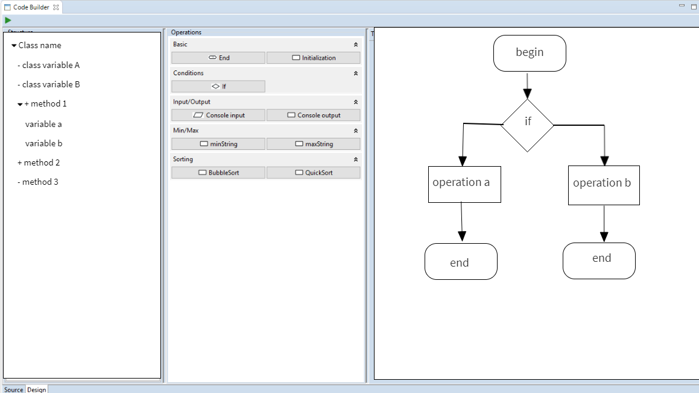

# Требования к проекту

# Содержание
1. [Введение](#1)  
	1.1. [Назначение](#1.1)   
	1.2. [Бизнес-требования](#1.2)  
		1.2.1. [Исходные данные](#1.2.1)  
		1.2.2. [Возможности бизнеса](#1.2.2)  
	1.3. [Аналоги](#1.3)  
2. [Требования пользователя](#2)  
	2.1. [Программные интерфейсы](#2.1)  
  	2.2. [Интерфейс пользователя](#2.2)  
  	2.3. [Характеристики пользователей](#2.3)  
  		2.3.1. [Аудитория приложения](#2.3.1)  
  	2.4. [Предположения и зависимости](#2.4)  
3. [Системные требования](#3.)  
  	3.1. [Функциональные требования](#3.1)  
  		3.1.1. [Основные функции](#3.1.1)  
  			3.1.1.1. [Редактирование кода в текстовом режиме](#3.1.1.1) 
  			3.1.1.2. [Редактирование файла в графическом режиме](#3.1.1.2) 
	  			3.1.1.2.1 [Просмотр структуры класса](#3.1.1.2.1) 
	  			3.1.1.2.2 [Редактирование класса](#3.1.1.2.2) 
	  			3.1.1.2.3 [Редактирование метода](#3.1.1.2.3) 
	  			3.1.1.2.4 [Генерация кода](#3.1.1.2.4) 
  			3.1.1.3. [Сохранение файла](#3.1.1.3) 
  		3.1.2. [Функции не поддерживаемые приложением](#3.1.2) 
  	3.2. [Нефункциональные требования](#3.2)  
   		3.2.1. [Атрибуты качества](#3.2.1)  
    		3.2.1.1. [Требования к совместимости](#3.2.1.1)  
    		3.2.1.2. [Требования к безопасности](#3.2.1.2)  
    	3.2.2. [Внешние интерфейсы](#3.2.2)  
    	3.2.3. [Ограничения](#3.2.3)  

# Глоссарий 
- WYSIWYG (what you see is what you get) - свойство прикладных программ, в которых содержание отображается в процессе редактирования и выглядит максимально близко похожим на конечную продукцию.
- Генеративное программирование - автоматическая генерация кода на основе библиотечных подпрограмм.
# 1 Введение 

## 1.1 Назначение 

В этом документе описаны функциональные и нефункциональные требования к проекту __CodeBuilder__. Документ предназначен для разработчика, который будет реализовывать и проверять корректность системы.

## 1.2 Бизнес-требования 

### 1.2.1 Исходные данные 
IT является одной из самых быстрорастущих сфер в данный момент.  Оптимизация процесса программирования ведет к повышению продуктивности работы.

### 1.2.2 Возможности бизнеса 
При создании программы, некоторые функциональные блоки повторяются многократно с незначительными изменениями.
Разработчики ищут способы использовать такие блоки повторно, т.к. повторное использование проверенного кода позволяет избежать ошибок и позволяет достичь более высокого уровня абстракций при разработке приложения.

## 1.3 Аналоги 
Большое количество аналогов предназначены для разработки пользовательского интерфейса. __CodeBuilder__ предоставляет возможность построения бизнес логики работы программы.
 - [WindowBuilder](https://www.eclipse.org/windowbuilder/) - WYSIWYG редактор пользовательского интерфейса, написанного на языке Java, интегрированный в платформу Eclipse.
	 - Используется для разработки интерфейса приложения, а не его логики.
 - [Java editor](http://javaeditor.org) - среда разработки, включающая в себя средства построения программы на основе структурной схемы.
   - Отсутствует интеграция с популярными и мощными средами разработки.
 - [Flowgorithm](http://www.flowgorithm.org) - средство построения структурных схем с возможностью генерации кода для многих основных языков программирования
   - Отсутствует интеграция с популярными и мощными средами разработки.
   - Являясь средством для разработки структурных диаграмм в общем виде, не использует специфические для языка Java решения. 

## 2. Требования пользователя 

### 2.1 Программные интерфейсы 

Приложение является плагином для среды разработки Eclipse. Язык разработки - Java.

### 2.2 Интерфейс пользователя 

- Вкладка текстового редактора.
  
- Вкладка графического редактора.
  

### 2.3 Характеристики пользователей 

### 2.3.1 Аудитория приложения 
Приложение нацелено на Java программистов, использующих среду  Eclipse для разработки проектов.  Их можно разделить на две группы:
- Пользователи, использующие редактор только в текстовом режиме, в качестве стандартного Java редактора для среды разработки.
- Пользователи, использующие графический редактор для построения методов класса на основе заготовленных подпрограмм.

## 2.4 Предположения и зависимости 
Работа приложения возможна только внутри среды разработки Eclipse.

# 3 Системные требования 

## 3.1 Функциональные требования 

### 3.1.1 Основные функции 

#### 3.1.1.1 Редактирование кода в текстовом режиме 
**Описание.** Пользователь имеет возможность использовать редактор для работы с файлом, содержащим код на языке Java, в текстовом режиме.

| Функция | Требования | 
|:---|:---|
| Использование тестового редактора | Приложение должно предоставить возможности работы с Java кодом идентичные возможностям стандартного редактора Eclipse |

#### 3.1.1.2 Редактирование файла в графическом режиме 
**Описание.** Пользователь имеет возможность использовать редактор для работы с файлом, содержащим код на языке Java, в графическом режиме.

##### 3.1.1.2.1 Просмотр структуры класса 
**Описание.** Пользователь имеет возможность просматривать структуру редактируемого класса.

| Функция | Требования | 
|:---|:---|
| Просмотр существующей структуры класса| Пользователь должен иметь возможность просматривать существующие методы и переменные уровня класса. |

##### 3.1.1.2.2 Редактирование класса 
**Описание.** Пользователь имеет возможность редактировать элементы (переменные и методы) класса.

| Функция | Требования | 
|:---|:---|
|Декларирование методов| Пользователь должен иметь возможность декларировать новые методы.|
|Декларирование переменных класса| Пользователь должен иметь возможность декларировать новые переменные уровня класса.|
|Удаление элемента класса| Пользователь должен иметь возможность удалять методы и переменные уровня класса.|

##### 3.1.1.2.3 Редактирование метода 
**Описание.** Пользователь имеет возможность редактировать методы класса.

| Функция | Требования | 
|:---|:---|
|Декларирование переменных  метода| Пользователь должен иметь возможность декларировать новые переменные уровня метода.|
|Удаление переменных метода| Пользователь должен иметь возможность удалять переменные уровня метода.|
|Добавление функционального блока в структуру метода| Пользователь должен иметь возможность добавления библиотечных блоков в функциональную структуру метода.|

##### 3.1.1.2.4 Генерация кода 
**Описание.** Пользователь имеет возможность генерировать код на основе внесенных изменений.

| Функция | Требования | 
|:---|:---|
|Генерация кода на основе внесенных изменений| Пользователь должен иметь возможность генерации кода на языке Java соответствующего внесенным, с помощью графического редактора, изменениям.|

#### 3.1.1.3 Сохранение файла
**Описание.** Пользователь имеет возможность сохранять изменения в файле. 

| Функция | Требования | 
|:---|:---|
|Сохранение файла| Пользователь должен иметь возможность сохранения файла, при этом должна происходить генерация не сохранённых в графическом редакторе изменений.|

### 3.1.2 Функции не поддерживаемые приложением 
1. Приложение не поддерживает создание графической функциональной структуры метода на основе его текстового представления.
2. Приложение не поддерживает отслеживание изменений созданной графической  функциональной структуры после генерации кода.

## 3.2 Нефункциональные требования 

### 3.2.1 Атрибуты качества 

#### 3.2.1.1 Требования к совместимости 
Приложение должно быть совместимо с последней версией платформы Eclipse.

#### 3.2.1.2 Требования к безопасности 
Приложение не хранит персональных данных.

### 3.2.2 Внешние интерфейсы 
Элементы графического интерфейса поддерживают изменения размера.

### 3.2.3 Ограничения 
1. Приложение интегрирована в среду разработки Eclipse.
