# Проектирование системы
## Содержание
1. [Behavioral design](#1)  
	1.1. [Use cases](#1.1)  
	1.2. [Actors description](#1.2)   
	1.3. [Use case requirements](#1.3)  
		1.3.1. [Edit code](#1.3.1)  
		1.3.2. [Save file](#1.3.2)  
		1.3.3. [View class structure](#1.3.3)  
		1.3.4. [Method declaration](#1.3.4)  
		1.3.5. [Class variable declaration](#1.3.5)  
		1.3.6. [Class member deleting](#1.3.6)  
		1.3.7. [Method editing](#1.3.7)  
		1.3.8. [Method variable declaration](#1.3.8)  
		1.3.9. [Method variable deleting](#1.3.9)  
		1.3.10. [Add functional block](#1.3.10)  
		1.3.11. [Parameterize functional block](#1.3.11)  
		1.3.12. [Generate code](#1.3.12)  
2. [Structureal design](#2)  
	2.1. [Class diagrams](#2.1)  
		2.1.1 [Logic class diagram](#2.1.1)  
		2.1.2 [UI class diagram](#2.1.2)  
	2.2 [Component diagram](#2.2) 
	2.3 [Deployment diagram](#2.3) 

## 1. Поведенческое проектирование

### 1.1. Диаграмма использования

### 1.2. Описание актёров
|Актёр|Описание|
|:---|:---|
|Programmer|Программист, который использует редактор только в текстовом режиме.|
|Design programmer|Программист, который использует графический редактор в дополнение к текстовому.|

### 1.3. Варианты использования (сценарии)
Сценарии выполнения вариантов использования описаны с помощью потоков событий и отображены в виде диаграмм активности.  
#### 1.3.1. Edit code
##### 1.3.1.2. Поток событий
**Описание.** Вариант использования "Edit code" позволяет пользователю редактировать исходный код, представленный в текстовом виде.  

**Основной поток.**  
 1. Вариант использования начинается, когда пользователь вносит изменения в файл в режиме текстового редактора.  
 2. Приложение использует стандартный "Java code editor", предоставляемый платформой Eclipse 
 3. Вариант использования завершается.  

##### 1.3.1.3. Диаграмма активности

##### 1.3.1.3. Диаграмма последовательности
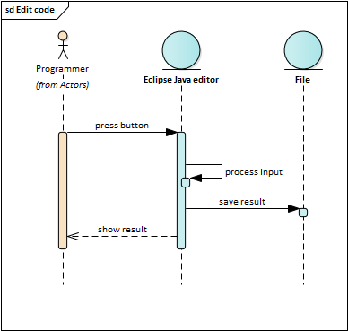
##### 1.3.1.4. Диаграмма состояний
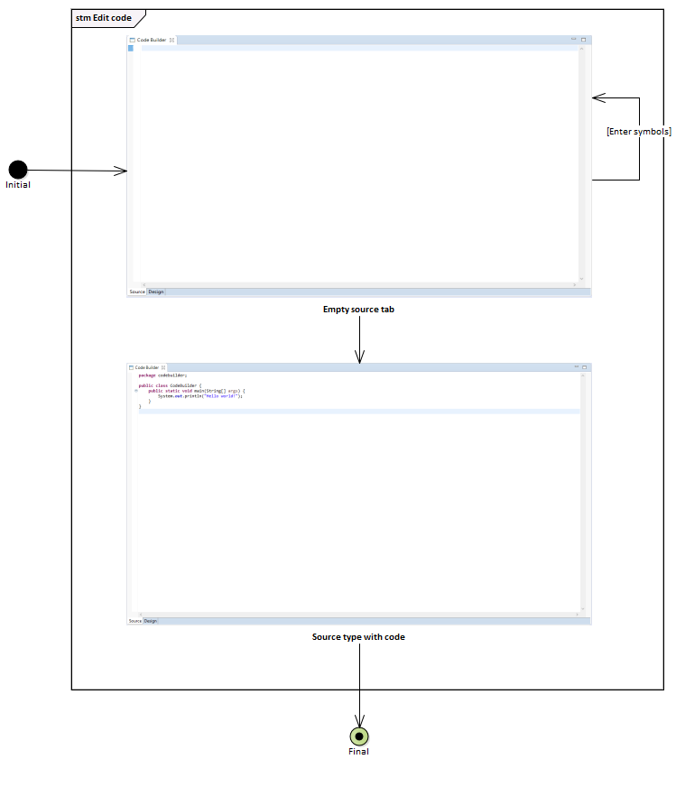

#### 1.3.2. Save file
##### 1.3.2.1. Поток событий
**Описание.** Вариант использования "Save file" позволяет пользователю сохранить изменения в файле, включая изменения внесенные с помощью графического редактора.  

**Основной поток.**  
 1. Вариант использования начинается, когда пользователь выбирает в строке меню одну из опций Save, Save as, Save all в разделе File или нажимает комбинацию клавиш Ctrl+S.  
 2. Приложение проверяет, существуют ли не сохраненные изменения внесённые с помощью графического редактора. Если существуют, то выполняется альтернативный поток А1.  
 3. Приложение сохраняет все изменения, внесенные в файл, на диске. 
 4. Вариант использования завершается.  

**Альтернативный поток А1.**  
 1. Приложение предлагает пользователю сгенерировать код по не сохранённым изменениям или отменить сохранение. Открывается окно "Generate code" с кнопками "Ок" и "Отмена".
 2. Пользователь нажимает одну из кнопок.
 3. Окно  "сгенерировать код" закрывается.
 4. Если была нажата кнопка "Ок" начинается выполнение пункта 3 основного потока. Если была нажата кнопка "Отмена" вариант использования завершается.
##### 1.3.2.2. Диаграмма активности
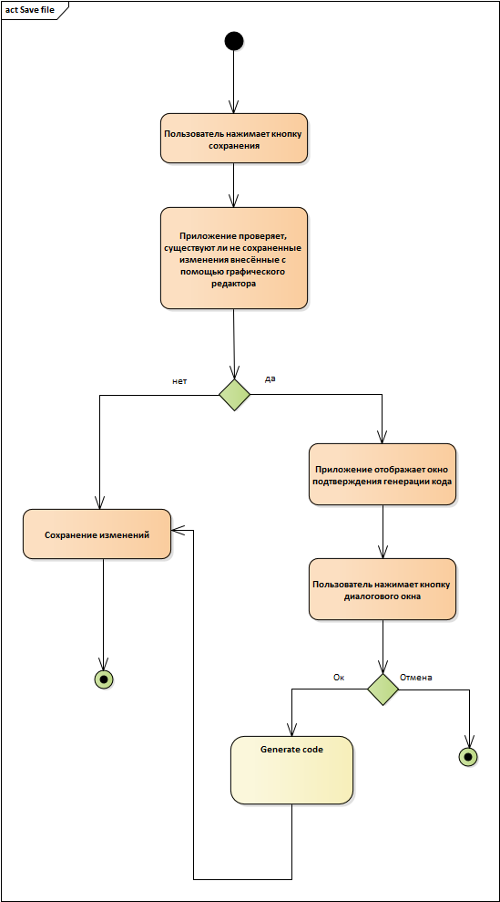
##### 1.3.2.3. Диаграмма последовательности
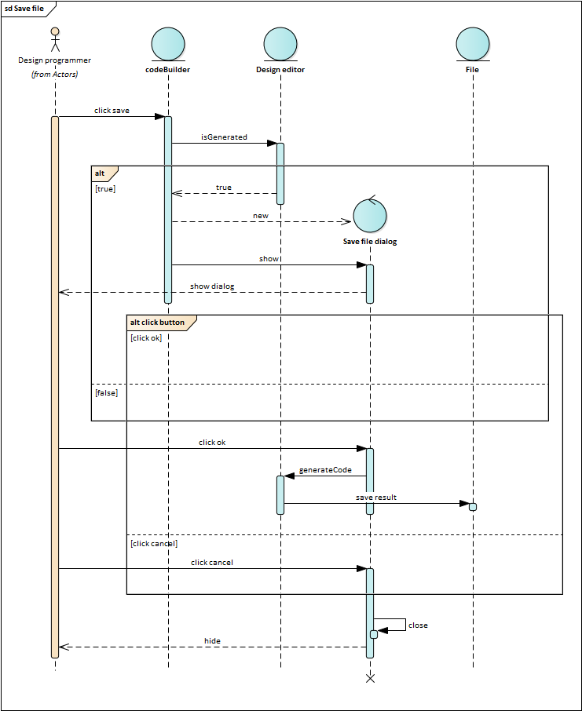
##### 1.3.1.4. Диаграмма состояний
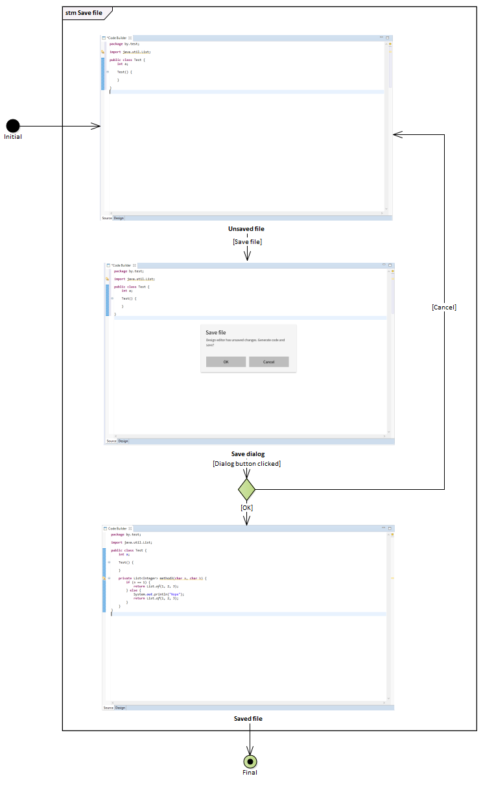

#### 1.3.3. View class structure
##### 1.3.3.1. Поток событий
**Описание.** Вариант использования "View class structure" позволяет пользователю получить информацию элементах, находящихся на уровне редактируемого класса.  

**Основной поток.**  
1. Вариант использования начинается, когда пользователь переходит на вкладку графического редактора.  
2. Приложение отображает структуру редактируемого класса как часть пользовательского интерфейса в разделе "Class summary".  
3. Вариант использования завершается.  
##### 1.3.3.2. Диаграмма активности
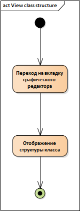
##### 1.3.3.3. Диаграмма последовательности
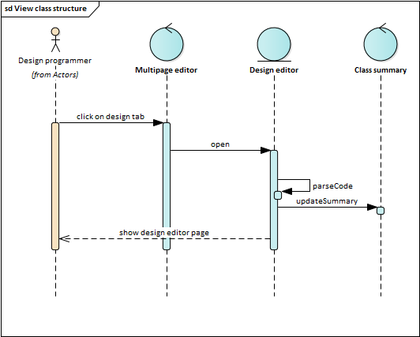
##### 1.3.1.4. Диаграмма состояний
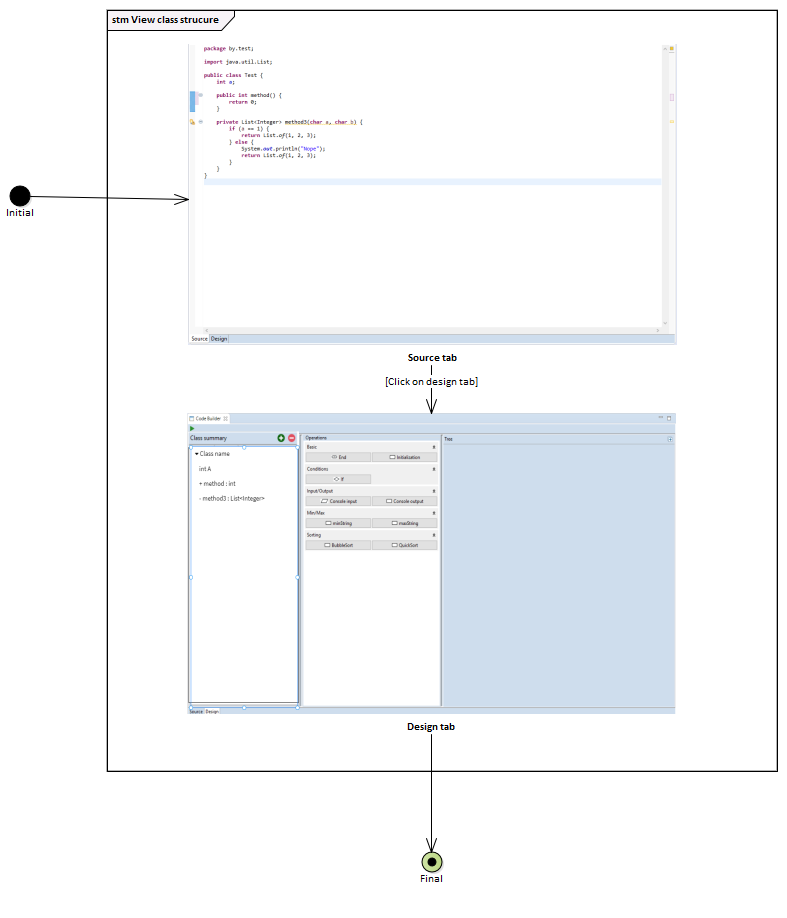

#### 1.3.4. Method declaration
##### 1.3.4.1. Поток событий
**Описание.** Вариант использования "Method declaration" позволяет пользователю декларировать новый метод с помощью графического редактора.  
**Предусловия.** Пользователь находится во вкладке графического редактора. 

**Основной поток.**  
1. Вариант использования начинается, когда пользователь нажимает кнопку "Add method".  
2. Приложение открывает окно декларации нового метода.
3. Пользователь вводит необходимые данные.
4. Если пользователь закрывает окно или нажимает кнопку отмены, начинается выполнение 7 пункта основного потока.
5. Если пользователь нажимает кнопку "Ок", метод сохраняется.
6. Декларация метода заносится в раздел "Class summary".
7. Окно закрывается.
8. Вариант использования завершается.  
##### 1.3.4.2. Диаграмма активности
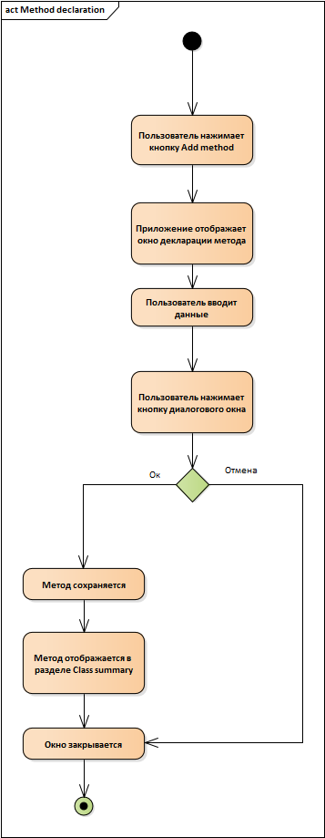
##### 1.3.4.3. Диаграмма последовательности
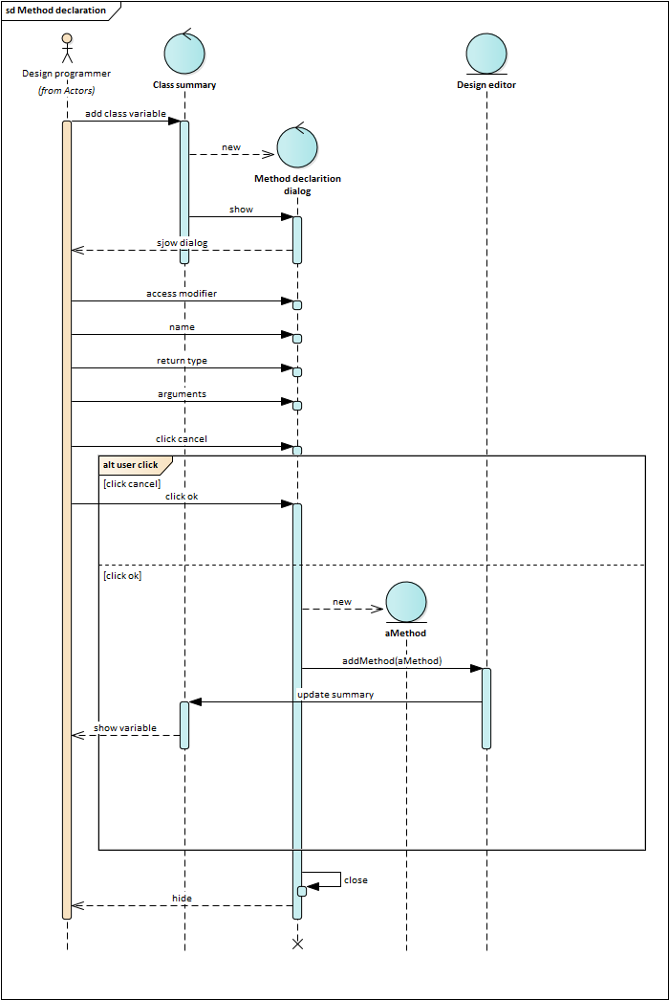
##### 1.3.1.4. Диаграмма состояний
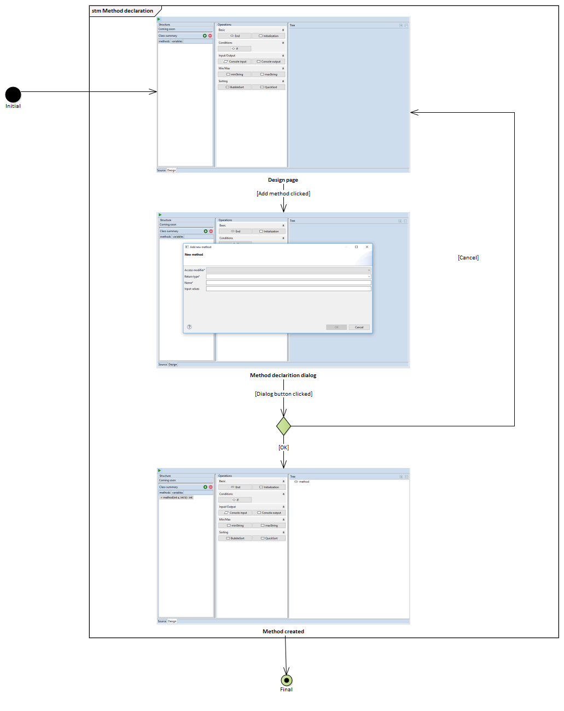

#### 1.3.5. Class variable declaration
##### 1.3.5.1. Поток событий
**Описание.** Вариант использования "Class variable declaration" позволяет пользователю декларировать новую переменную уровня класса с помощью графического редактора.  
**Предусловия.** Пользователь находится во вкладке графического редактора. 

**Основной поток.**  
1. Вариант использования начинается, когда пользователь нажимает кнопку "Add class variable".  
2. Приложение открывает окно декларации новой переменной класса.
3. Пользователь вводит необходимые данные.
4. Если пользователь закрывает окно или нажимает кнопку отмены, начинается выполнение 7 пункта основного потока.
5. Если пользователь нажимает кнопку "Ок", переменная класса сохраняется.
6. Декларация метода заносится в раздел "Class summary".
7. Окно закрывается.
8. Вариант использования завершается.  
##### 1.3.5.2. Диаграмма активности
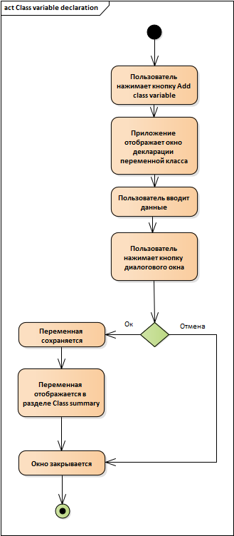
##### 1.3.5.3. Диаграмма последовательности
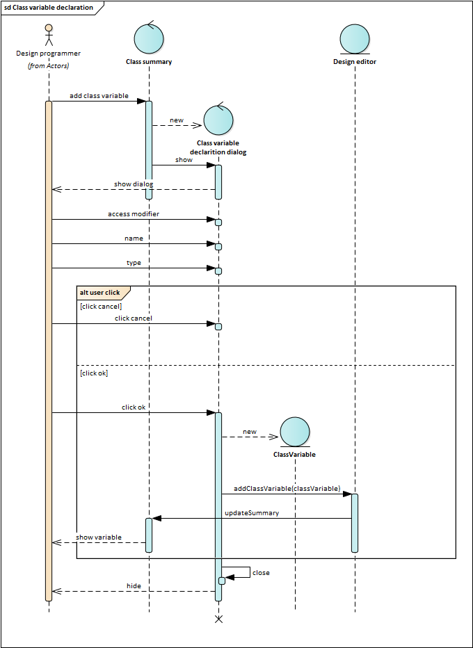
##### 1.3.1.4. Диаграмма состояний
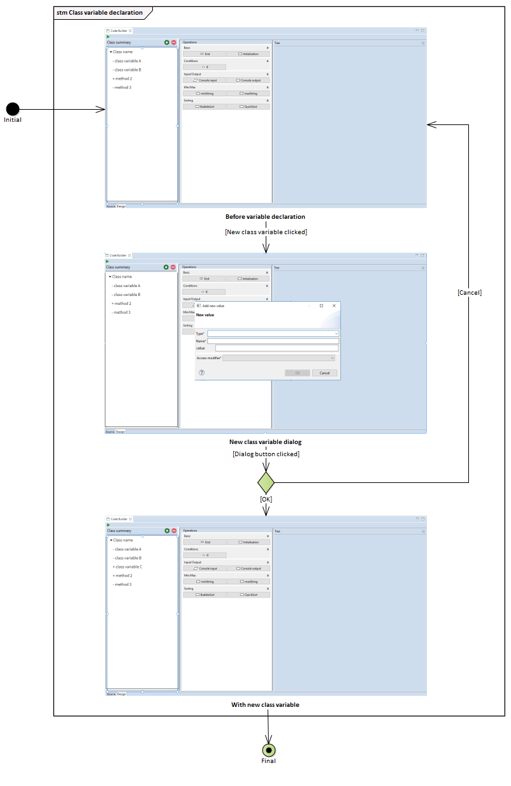

#### 1.3.6. Class member deleting
##### 1.3.6.1. Поток событий
**Описание.** Вариант использования "Class member deleting" позволяет пользователю удалять методы или переменные уровня класса.  
**Предусловия.** Пользователь находится во вкладке графического редактора.

**Основной поток.**  
1. Вариант использования начинается, когда пользователь нажимает правой кнопкой на элементе класса и выбирает опцию удаления (delete).  
2. Элемент перестаёт быть доступным пользователю.
3. Вариант использования завершается.  
##### 1.3.6.2. Диаграмма активности
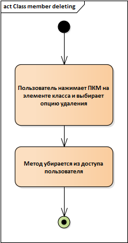
##### 1.3.6.3. Диаграмма последовательности
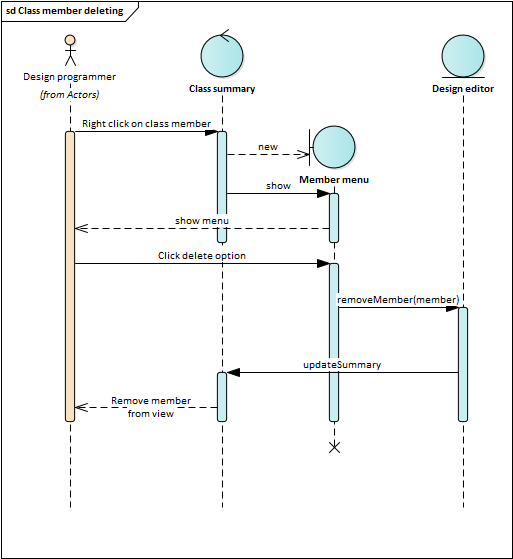
##### 1.3.1.4. Диаграмма состояний
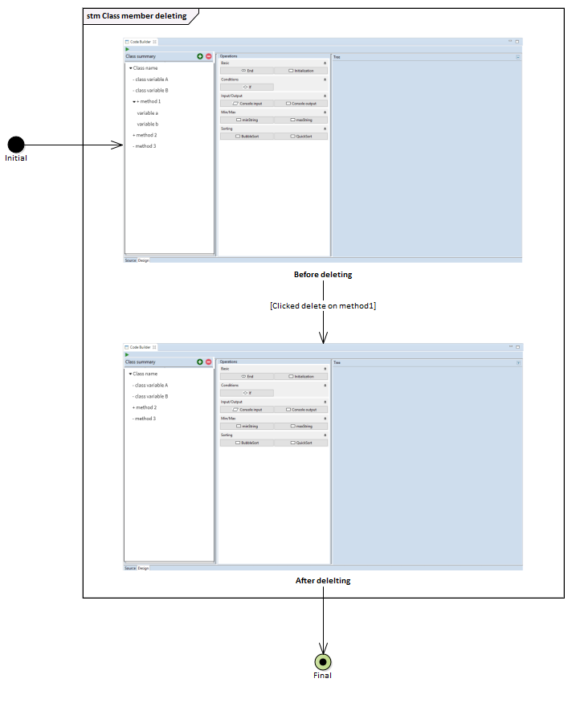

#### 1.3.7. Method editing
##### 1.3.7.1. Поток событий
**Описание.** Вариант использования "Method editing" позволяет пользователю начать редактирование метода с помощью графического редактора.  
**Предусловия.** Пользователь находится во вкладке графического редактора. 

**Основной поток.**  
1. Вариант использования начинается, когда пользователь выбирает двойным кликом один из методов класса.  
2. Приложение отображает построенную ранее пользователем функциональную структуру выбранного метода.
3. Приложение отображает переменные выбранного метода.
4. Вариант использования завершается.  
##### 1.3.7.2. Диаграмма активности
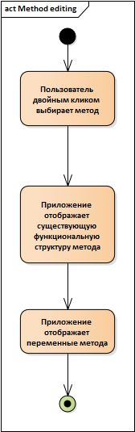
##### 1.3.7.3. Диаграмма последовательности
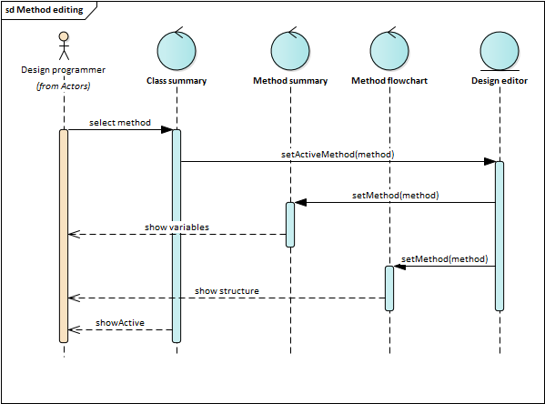
##### 1.3.1.4. Диаграмма состояний
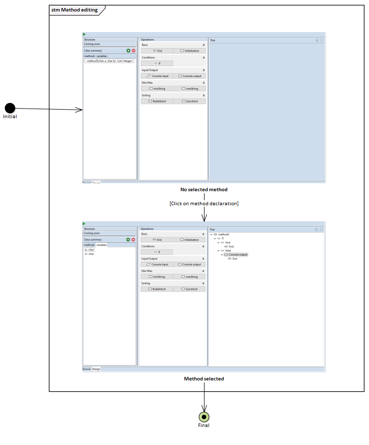

#### 1.3.8. Method variable declaration
##### 1.3.8.1. Поток событий
**Описание.** Вариант использования "Method variable declaration" позволяет пользователю декларировать новую переменную в теле метода с помощью графического редактора.  
**Предусловия.** Пользователь находится во вкладке графического редактора. Пользователь выбрал метод для редактирования.

**Основной поток.**  
1. Вариант использования начинается, когда пользователь нажимает кнопку "Add variable".  
2. Приложение открывает окно декларации новой переменной.
3. Пользователь вводит необходимые данные.
4. Если пользователь закрывает окно или нажимает кнопку отмены, начинается выполнение 6 пункта основного потока.
5. Если пользователь нажимает кнопку "Ок", переменная метода сохраняется.
6. Окно закрывается.
7. Вариант использования завершается.  
##### 1.3.8.2. Диаграмма активности
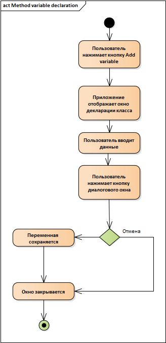
##### 1.3.8.3. Диаграмма последовательности
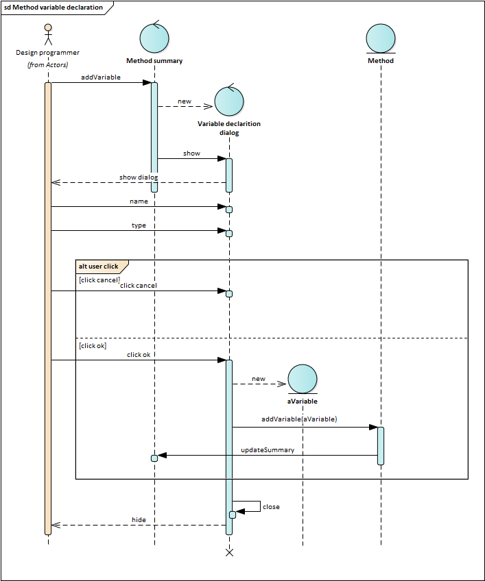
##### 1.3.1.4. Диаграмма состояний

#### 1.3.9. Method variable deleting
##### 1.3.9.1. Поток событий
**Описание.** Вариант использования "Method member deleting" позволяет пользователю удалять переменные уровня метода.  
**Предусловия.** Пользователь находится во вкладке графического редактора. Пользователь выбрал метод для редактирования.

**Основной поток.**  
1. Вариант использования начинается, когда пользователь нажимает правой кнопкой на переменной метода и выбирает опцию удаления (delete).  
2. Переменная перестаёт быть доступной пользователю.
3. Вариант использования завершается. 

##### 1.3.9.2. Диаграмма активности
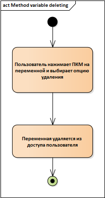
##### 1.3.9.3. Диаграмма последовательности
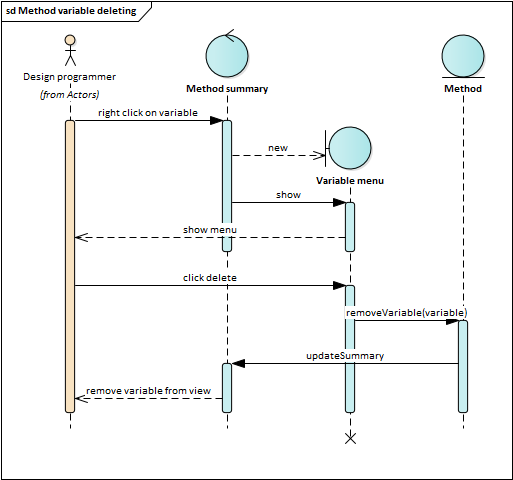
##### 1.3.1.4. Диаграмма состояний
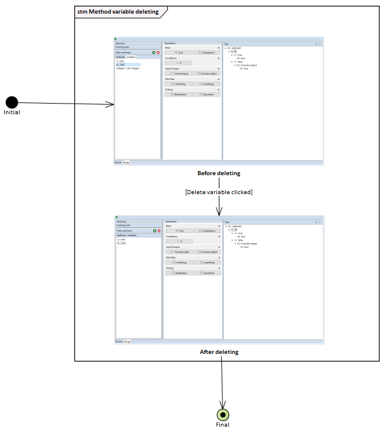

#### 1.3.10. Add functional block
##### 1.3.10.1. Поток событий
**Описание.** Вариант использования "Add functional block" позволяет пользователю добавить блок из списка библиотечных операций в графическую функциональную структуру метода.  
**Предусловия.** Пользователь находится во вкладке графического редактора. Пользователь выбрал метод для редактирования. 

**Основной поток.**  
1. Вариант использования начинается, когда пользователь выбирает кликом мыши одну из доступных библиотечных операций.
2. Пользователь нажимает на другой элемент графического редактора.
3. Если нажатие было в области структурной схемы метода, запускается альтернативный поток А1.
4. Выбор операции отменяется.
5. Вариант использования завершается.  

**Альтернативный поток А1.**  
 1. Приложение добавляет графическое отображение операции на структурную схему.
 2. Начинается выполнение пункта 2 основного потока.

##### 1.3.10.2. Диаграмма активности

##### 1.3.10.3. Диаграмма последовательности
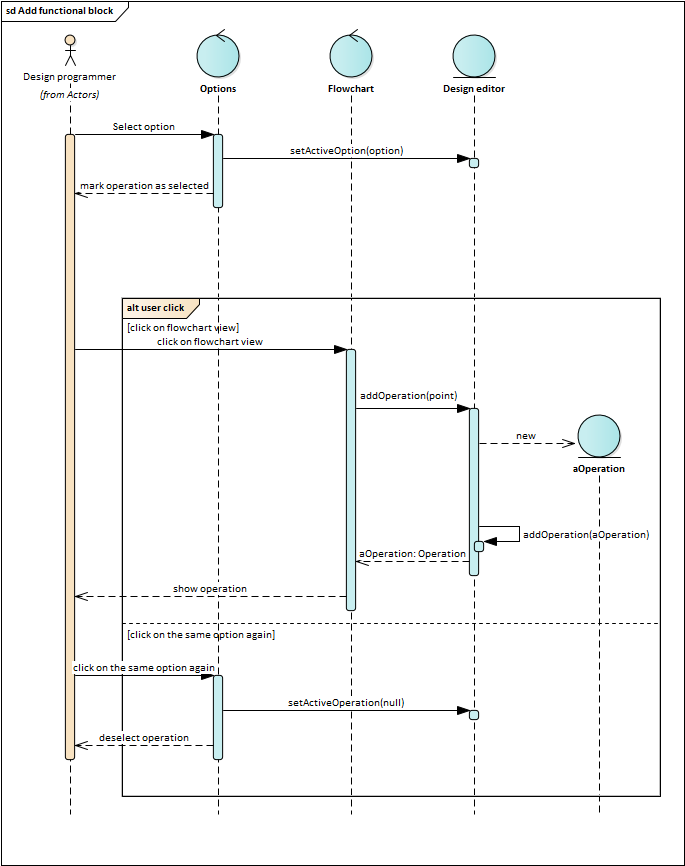
##### 1.3.1.4. Диаграмма состояний
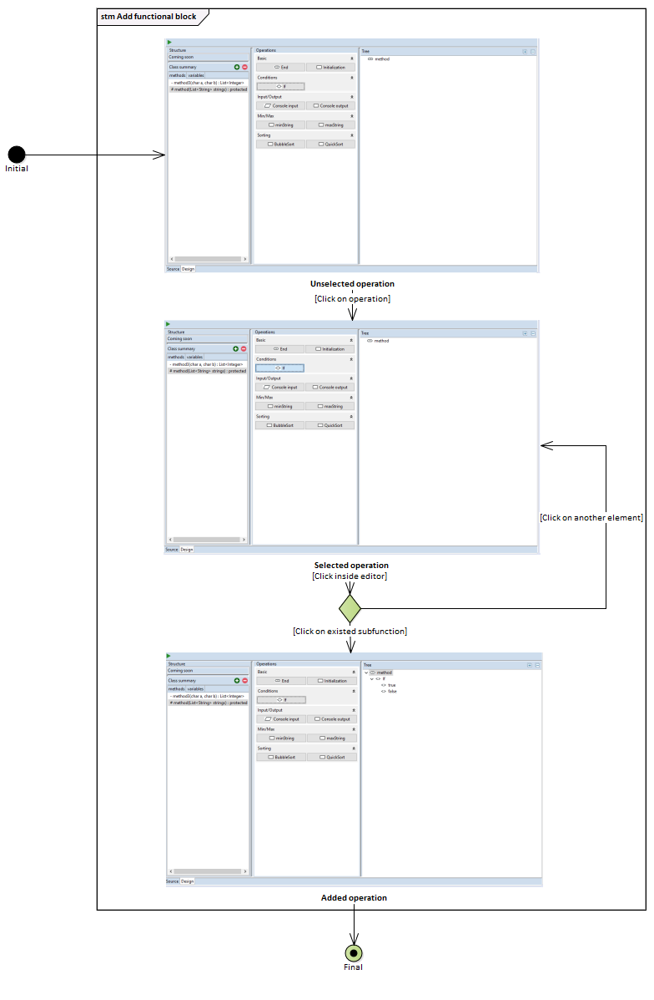

#### 1.3.11. Parameterize functional block
##### 1.3.11.2. Поток событий
**Описание.** Вариант использования "Parameterize functional block" позволяет пользователю параметризировать блоки находящиеся в функциональной структуре метода.  
**Предусловия.** Пользователь находится во вкладке графического редактора. Пользователь выбрал метод для редактирования. Структура метода содержит один или несколько функциональных блоков.

**Основной поток.**  
1. Вариант использования начинается, когда пользователь выбирает двойным кликом блок в графическом отображении функциональной структуры метода.
2. Приложение открывает окно параметризации блока.
3. Пользователь вводит необходимые данные.
4. Если пользователь закрывает окно или нажимает кнопку отмены, начинается выполнение 6 пункта основного потока.
5. Если пользователь нажимает кнопку "Ок", блок выбранный инициализируется введёнными данными.
6. Окно закрывается.
7. Вариант использования завершается.  
##### 1.3.11.3. Диаграмма активности

##### 1.3.11.3. Диаграмма последовательности

##### 1.3.1.4. Диаграмма состояний

#### 1.3.12. Generate code
##### 1.3.12.1. Поток событий
**Описание.** Вариант использования "Generate code" позволяет пользователю применить изменения, внесенные в окне графического редактора.  
**Предусловия.** Пользователь находится во вкладке графического редактора. 
**Основной поток.**  
 1. Вариант использования начинается, когда пользователь нажимает кнопку в виде зеленой стрелки в верхней части редактора.  
 2. Приложение переносит все изменения, сделанные в графическом редакторе, в код программы, и сохраняет их в исходном файле.  
 3. Вариант использования завершается.  

##### 1.3.12.2. Диаграмма активности
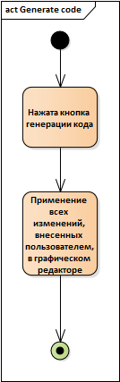
##### 1.3.12.3. Диаграмма последовательности

##### 1.3.1.4. Диаграмма состояний
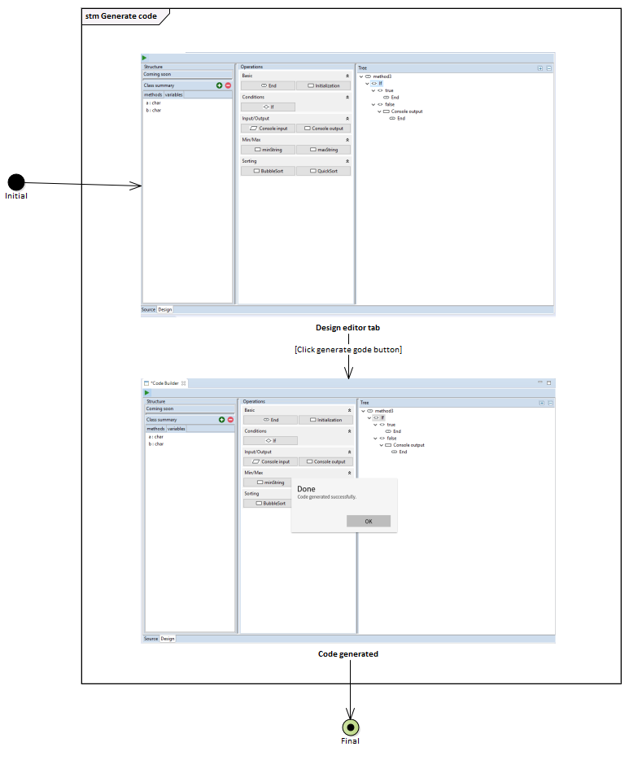

## 2. Структурное проектирование

### 2.1 Диаграммы классов 

#### 2.1.1 Диаграмма классов бизнес логики 
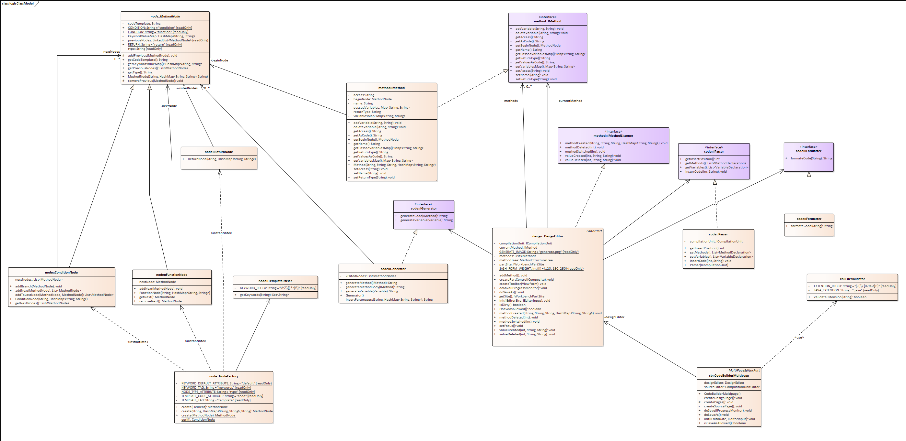
#### 2.1.2 Диаграмма классов пользовательского интерфейса 
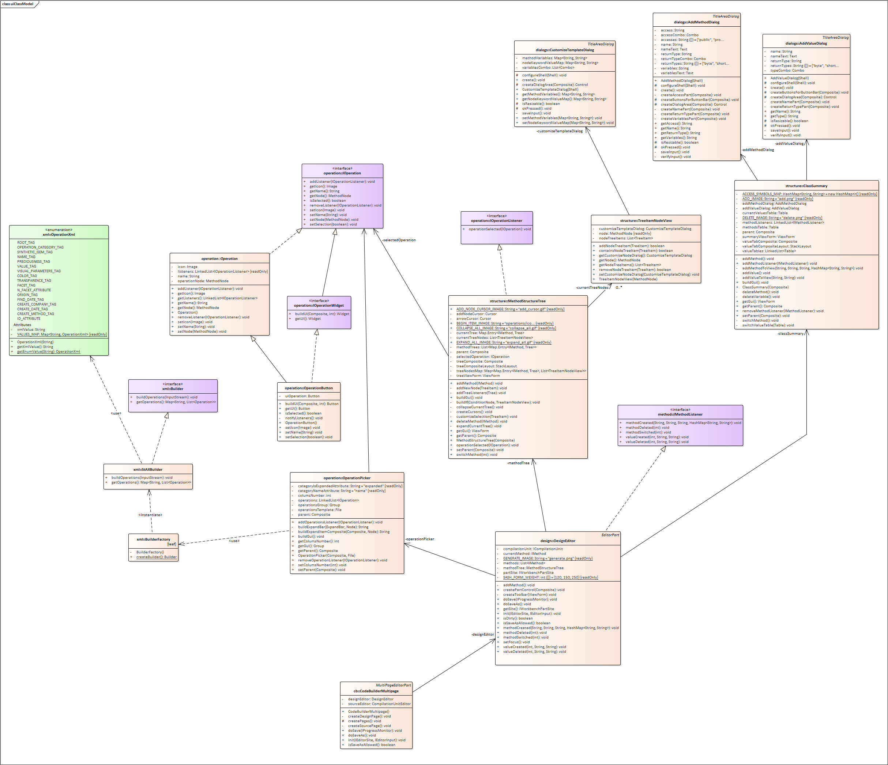

### 2.2 Диаграмма компонентов 
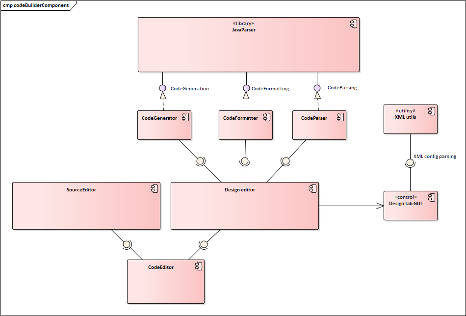

### 2.3 Диаграмма развёртывания 
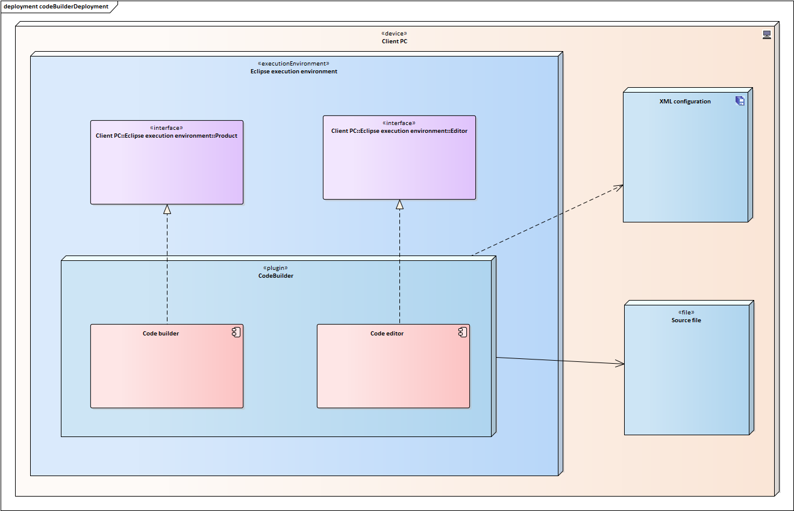
